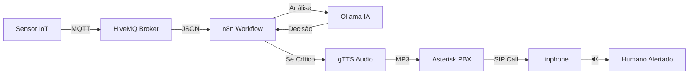

# 🚨 Smart Voice Alert

> Um laboratório self-hosted de monitoramento inteligente que combina IoT, IA local, automação e telefonia VoIP para detectar situações críticas e alertar humanos por ligação de voz automática — tudo offline e privado.

---

## 🎯 Objetivo Principal

```
Sensor detecta algo (MQTT) 
    ↓
IA local decide se é crítico (Ollama) 
    ↓
Se SIM → Asterisk faz ligação automática via SIP (Linphone) 
    ↓
Humano recebe alerta por voz (gTTS)
```

**Tudo funciona 100% offline e privado!** 🔒

---

## 📊 Visão Geral do Fluxo



### Detalhamento do Processo

1. **Sensor** (simulado ou real) publica JSON no HiveMQ via MQTT
   - Exemplo: `{"temp":68,"local":"rack-3"}`

2. **n8n** captura o dado e envia para Ollama analisar

3. **Ollama** responde com decisão estruturada:
   - ✅ `"SIM: razão curta"` 
   - ❌ `"NÃO: razão curta"`

4. **Se "SIM"**, n8n:
   - Gera áudio TTS (Text-to-Speech)
   - Salva em pasta compartilhada
   - Usa ARI para Asterisk originar chamada

5. **Linphone** toca → atende → ouve a voz com o alerta

---

## 🛠️ Tecnologias Principais

| Categoria | Tecnologia | Função |
|-----------|-----------|--------|
| **Mensageria** | HiveMQ CE | Broker MQTT para sensores IoT |
| **Automação** | n8n | Orquestração de workflows |
| **IA Local** | Ollama | LLM local (llama3.2:3b) para análise |
| **VoIP/PBX** | Asterisk (PJSIP) | Sistema de telefonia IP |
| **Softphone** | Linphone | Cliente SIP para receber chamadas |
| **TTS** | gTTS | Síntese de voz (Google TTS) |
| **Interface** | Ubuntu LXDE + VNC | Desktop remoto para testes |
| **Debug VoIP** | SNGREP | Monitor de tráfego SIP |
| **VPN** | WireGuard *(opcional)* | Acesso remoto seguro |
| **Orquestração** | Docker Compose | Containerização completa |

---

## 📁 Estrutura do Repositório

```
smart-voice-alert/
│
├── 📄 docker-compose.yml          # Orquestração de todos os containers
├── 📁 asterisk_conf/              # Configurações Asterisk
│   ├── pjsip.conf                 # Endpoints SIP
│   ├── extensions.conf            # Dialplan
│   ├── ari.conf                   # Asterisk REST Interface
│   └── ...
├── 📁 shared/                     # Volume compartilhado (áudios TTS)
├── 📁 sounds/en/                  # Sons do Asterisk (tt-monkeys, etc.)
├── 📁 wireguard/                  # Configurações WireGuard (opcional)
│   └── peer1/
│       └── peer1.conf
└── 📄 README.md                   # Este arquivo
```

---

## 💻 Requisitos do Sistema

- ✅ **Docker** e **Docker Compose** instalados (v2+)
- ✅ Mínimo **8 GB de RAM** (para rodar Ollama 3B)
- ✅ Conexão à internet (apenas para pull inicial de imagens)
- ✅ Celular/PC para testar VPN *(opcional)*

---

## 🚀 Tutorial Passo a Passo de Execução

### 📥 Passo 1: Clone o Repositório

```bash
git clone https://github.com/0xEg0x/smart-voice-alert.git
cd smart-voice-alert
```

---

### 📋 Passo 2: Verifique o `docker-compose.yml`

Certifique-se que o arquivo contém todos os serviços necessários:

```yaml
services:
  hivemq:
    image: hivemq/hivemq-ce:latest
    container_name: rcon-hivemq
    ports:
      - "1883:1883"
      - "8080:8080"
    networks:
      - rcon-net
  
  n8n:
    image: n8nio/n8n:latest
    container_name: rcon-n8n
    ports:
      - "5678:5678"
    environment:
      - N8N_BASIC_AUTH_ACTIVE=false
    volumes:
      - n8n_data:/home/node/.n8n
      - ./shared:/shared
    networks:
      - rcon-net
  
  ollama:
    image: ollama/ollama:latest
    container_name: rcon-ollama
    ports:
      - "11434:11434"
    volumes:
      - ollama_data:/root/.ollama
    networks:
      - rcon-net
  
  asterisk:
    image: andrius/asterisk:latest
    container_name: rcon-asterisk
    ports:
      - "5060:5060/udp"
      - "10000-10099:10000-10099/udp"
      - "8088:8088"
    volumes:
      - ./asterisk_conf:/etc/asterisk
      - ./shared:/shared
      - ./sounds/en:/var/lib/asterisk/sounds/en
    networks:
      - rcon-net
  
  desktop:
    image: dorowu/ubuntu-desktop-lxde-vnc
    container_name: rcon-desktop
    ports:
      - "6080:80"
      - "5900:5900"
    environment:
      - VNC_PASSWORD=rcon123
    volumes:
      - ./shared:/shared
    networks:
      - rcon-net
  
  # WireGuard (opcional)
  wireguard:
    image: linuxserver/wireguard:latest
    container_name: rcon-wireguard
    cap_add:
      - NET_ADMIN
      - SYS_MODULE
    environment:
      - PUID=1000
      - PGID=1000
      - TZ=America/Sao_Paulo
      - SERVERPORT=51820
      - PEERS=1
      - PEERDNS=auto
      - INTERNAL_SUBNET=10.13.13.0
    ports:
      - "51820:51820/udp"
    volumes:
      - ./wireguard:/config
    networks:
      - rcon-net

volumes:
  n8n_data:
  ollama_data:
  shared:

networks:
  rcon-net:
    driver: bridge
```

---

### 📂 Passo 3: Crie Pastas Necessárias

```bash
mkdir -p asterisk_conf shared sounds/en wireguard
```

**Configure os arquivos:**

1. Copie as configurações do Asterisk para `asterisk_conf/`:
   - `pjsip.conf`
   - `extensions.conf`
   - `ari.conf`
   - etc.

2. Baixe sons para `sounds/en/`:
   - Exemplo: `tt-monkeys.ulaw` do [Asterisk downloads](https://www.asterisk.org/)

---

### ▶️ Passo 4: Inicie os Containers

```bash
docker compose up -d
```

**Aguarde 5-10 minutos** para o download das imagens e inicialização.

Verifique o status:

```bash
docker ps
```

**Saída esperada:**
```
CONTAINER ID   IMAGE                              STATUS
xxxxx          hivemq/hivemq-ce:latest           Up
xxxxx          n8nio/n8n:latest                  Up
xxxxx          ollama/ollama:latest              Up
xxxxx          andrius/asterisk:latest           Up
xxxxx          dorowu/ubuntu-desktop-lxde-vnc    Up
```

---

### 🤖 Passo 5: Configure Ollama (IA Local)

Entre no container e baixe o modelo:

```bash
docker exec -it rcon-ollama bash
ollama pull llama3.2:3b
exit
```

**Teste a IA:**

```bash
curl http://localhost:11434/api/generate -d '{
  "model": "llama3.2:3b",
  "prompt": "Teste rápido de funcionamento."
}'
```

**Resposta esperada:** JSON com o texto gerado pela IA.

---

### ⚙️ Passo 6: Configure n8n (Automação)

1. Acesse **http://localhost:5678** no navegador

2. Crie um novo workflow com os seguintes nós:

```
┌─────────────────────┐
│ MQTT Subscribe      │ ← Trigger
│ Topic: sensors/#    │
└──────────┬──────────┘
           │
┌──────────▼──────────┐
│ Function            │ ← Extrai mensagem JSON
│ $json.message       │
└──────────┬──────────┘
           │
┌──────────▼──────────┐
│ HTTP Request        │ ← Chama Ollama
│ POST /api/chat      │
│ llama3.2:3b         │
└──────────┬──────────┘
           │
┌──────────▼──────────┐
│ Function            │ ← Parse decisão (SIM/NÃO)
└──────────┬──────────┘
           │
┌──────────▼──────────┐
│ IF                  │ ← Verifica se é crítico
│ decisao == "SIM"    │
└─────┬────────┬──────┘
      │        │
     SIM      NÃO (stop)
      │
┌─────▼────────────────┐
│ HTTP Request (gTTS)  │ ← Gera áudio TTS
└──────────┬───────────┘
           │
┌──────────▼───────────┐
│ Write Binary File    │ ← Salva /shared/alert.mp3
└──────────┬───────────┘
           │
┌──────────▼───────────┐
│ HTTP Request (ARI)   │ ← Origina chamada Asterisk
│ POST /channels       │
│ endpoint: PJSIP/1001 │
│ extension: alert     │
│ context: ai-alert    │
└──────────────────────┘
```

3. **Salve** e **ative** o workflow

---

### 📞 Passo 7: Configure Asterisk (VoIP)

**Recarregue as configurações:**

```bash
docker exec -it rcon-asterisk asterisk -rx "dialplan reload"
docker exec -it rcon-asterisk asterisk -rx "pjsip reload"
```

**Teste chamada básica:**

1. Acesse o desktop via VNC: **http://localhost:6080**
   - Senha: `rcon123`

2. Abra o **Linphone**

3. Configure conta SIP:
   - **Usuário:** 1001
   - **Senha:** secret1001
   - **Domínio:** rcon-asterisk

4. Ligue para **999** → deve ouvir o som `tt-monkeys`

---

### 🔐 Passo 8: Configure VPN (Opcional, para sensores remotos)

1. Inicie o WireGuard:

```bash
docker compose up -d wireguard
```

2. Obtenha a configuração do peer:

```bash
cat ./wireguard/peer1/peer1.conf
```

3. **Importe no app WireGuard** do celular/PC

4. **Conecte** e teste publicar MQTT do dispositivo remoto

---

### 🧪 Passo 9: Execute e Teste

#### ✅ Teste 1: Temperatura Alta (Deve Alertar)

```bash
docker exec -it rcon-desktop mosquitto_pub \
  -h rcon-hivemq \
  -t sensors/temp \
  -m '{"temp":68,"local":"rack-3"}'
```

**Resultado esperado:**
- IA detecta anomalia
- Linphone toca
- Você atende
- Ouve voz: *"Alerta! Temperatura de 68 graus detectada em rack-3"*

---

#### ❌ Teste 2: Temperatura Normal (Não Deve Alertar)

```bash
docker exec -it rcon-desktop mosquitto_pub \
  -h rcon-hivemq \
  -t sensors/temp \
  -m '{"temp":28,"local":"sala"}'
```

**Resultado esperado:**
- IA determina que está normal
- **Nenhuma chamada é feita**

---

### 🔧 Passo 10: Troubleshooting

| Problema | Solução |
|----------|---------|
| **Sem áudio no Linphone** | Instale `pulseaudio-utils` no container desktop |
| **Erro no workflow n8n** | Verifique a aba **Executions** no n8n |
| **Asterisk não origina chamada** | Veja logs: `docker logs rcon-asterisk` |
| **VPN não conecta** | Verifique logs: `docker logs rcon-wireguard` |
| **Ollama lento** | Use GPU (adicione `deploy.resources` no compose) |

**Debug de SIP:**

```bash
docker exec -it rcon-desktop sngrep
```

---

## 💡 Use Cases

| Cenário | Detecção | Ação |
|---------|----------|------|
| 🖥️ **Monitoramento de Servidores** | Temperatura alta no rack | Ligação automática para TI |
| 🏠 **Casa Inteligente** | Sensor de fumaça dispara | Chamada para a família |
| 👴 **Saúde/Idosos** | Movimento suspeito detectado | Alerta para cuidador |
| 🔋 **Energia** | Bateria do nobreak baixa | Notificação de manutenção |
| 💧 **Vazamentos** | Sensor de água ativado | Chamada de emergência |

---

## 🗺️ Roadmap

- [ ] TTS offline (substituir gTTS por Piper/Coqui)
- [ ] DTMF para confirmação de recebimento
- [ ] Dashboard web para histórico de alertas
- [ ] Integração com sensores reais (ESP32/ESP8266)
- [ ] Suporte a múltiplos números de telefone
- [ ] Gravação de chamadas
- [ ] Webhooks para integrações externas

---

## 📄 Licença

**MIT License**

Copyright (c) 2026 Lucas

```
Permission is hereby granted, free of charge, to any person obtaining a copy
of this software and associated documentation files (the "Software"), to deal
in the Software without restriction, including without limitation the rights
to use, copy, modify, merge, publish, distribute, sublicense, and/or sell
copies of the Software, and to permit persons to whom the Software is
furnished to do so, subject to the following conditions:

The above copyright notice and this permission notice shall be included in all
copies or substantial portions of the Software.

THE SOFTWARE IS PROVIDED "AS IS", WITHOUT WARRANTY OF ANY KIND, EXPRESS OR
IMPLIED, INCLUDING BUT NOT LIMITED TO THE WARRANTIES OF MERCHANTABILITY,
FITNESS FOR A PARTICULAR PURPOSE AND NONINFRINGEMENT. IN NO EVENT SHALL THE
AUTHORS OR COPYRIGHT HOLDERS BE LIABLE FOR ANY CLAIM, DAMAGES OR OTHER
LIABILITY, WHETHER IN AN ACTION OF CONTRACT, TORT OR OTHERWISE, ARISING FROM,
OUT OF OR IN CONNECTION WITH THE SOFTWARE OR THE USE OR OTHER DEALINGS IN THE
SOFTWARE.
```

---

## 🤝 Contribuindo

Contribuições são bem-vindas! Sinta-se à vontade para:

1. Fazer fork do projeto
2. Criar uma branch para sua feature (`git checkout -b feature/AmazingFeature`)
3. Commit suas mudanças (`git commit -m 'Add some AmazingFeature'`)
4. Push para a branch (`git push origin feature/AmazingFeature`)
5. Abrir um Pull Request

---

## 📞 Contato

**Lucas** - [@0xEg0x](https://github.com/0xEg0x)

**Link do Projeto:** [https://github.com/0xEg0x/smart-voice-alert](https://github.com/0xEg0x/smart-voice-alert)

---

<div align="center">

**⭐ Se este projeto foi útil, considere dar uma estrela!**

Made with ❤️ and ☕ by Lucas

</div>
